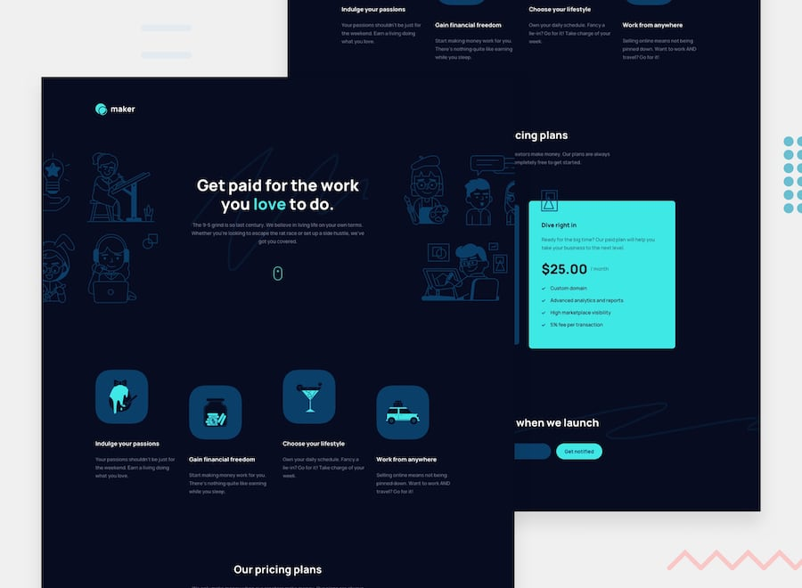

# Frontend Mentor - Maker Pre-launch Landing Page

## Table of contents

- [Frontend Mentor - Maker Pre-launch Landing Page](#)
  - [Table of contents](#table-of-contents)
  - [Overview](#overview)
    - [The challenge](#the-challenge)
    - [Screenshot](#screenshot)
    - [Links](#links)
  - [My process](#my-process)
    - [Built with](#built-with)
    - [What I learned](#what-i-learned)
  - [Author](#author)

## Overview

### The challenge

Users should be able to:

- View the optimal theme depending on the theme selected
- Email validation: view whether or not they have entered a valid email address

### Screenshot

### Links

- Solution URL: [View Github Code](https://github.com/jchapar/maker-fem)
- Live Site URL: [Visit Site](https://gilded-kitsune-c0532d.netlify.app/)

## My process

### Built with

- React JS
- Tailwind CSS
- Flexbox
- Mobile-first workflow
- Figma - For design files
- Formik & Yup for Form Validation

### What I learned

- Continued improvement with React Js.
- Used Formik & Yup for Form Validation on the email notification input.

## Author

- Frontend Mentor - [@jchapar](https://www.frontendmentor.io/profile/jchapar)
- Twitter - [@j_chapar](https://www.twitter.com/j_chapar)
